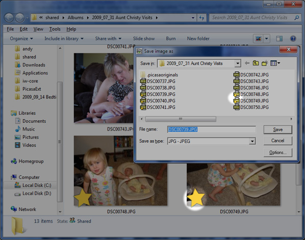

# PicasaExt

PicasaExt aims to add features to Windows Explorer to better integrate with Picasa. Presently, it's only feature is to show starred pictures in Windows Explorer

Please note that PicasaExt does not integrate with online Picasa in any way- it simply reads the ini files that Picasa uses to store information.

## System Requirements
Windows XP, Vista, or Windows 7
32 or 64-bit

## Notes
You may need to restart your computer (or log-off and on again) after installing.

## About
This project is written in C++ and includes Visual Studio 2008 project files and Wix 3 installer files.

This project is neither endorsed nor supported by Google.

## Features
Add a star overlay to images starred in Picasa: 
